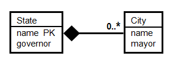

Normalization Quiz 
=======================

Question 1
--------------

Consider translating this UML diagram to relations. Which of the following relations would not be generated by any of the recommended translation schemes discussed in the video?

* Book(edition)
* Book(ISBN, edition)
* Publication(ISBN, pub-title, year)
* Publication(ISBN, pub-title, year, volume, edition)

**Answer:**
* Book(edition)

**Explanation:**
Book is a subclass of Publication and therefore must include at least the PK of its superclass.

Question 2
-----------------------

Based on this UML diagram, which of the following statements about Authors is correct?

* Every book has up to one author.
* A book may have no authors. 
* An article may have any number of authors.
* An author can write a book or contribute an article, but not both.

**Answer:** 
* A book may have no authors. 

**Explanation:**
The multiplicity of 0..* on the Author end of association Writes says that each book may have any number of authors, including none.

Question 3
-------------------------

Based on this UML diagram, which of the following relations best represents articles?

* Article(title, pages, keywords, ISBN, volume)
* Article(title, pages, keywords, ISBN)
* Article(title, pages, keywords, ISBN, pub-title, year)
* Article(title, pages, keywords, volume)

**Answer:** 
* Article(title, pages, keywords, ISBN)

**Explanation:**
Article is the included class in a Composition relationship. Thus, its relation should contain the attributes of Article, plus the key of its including class. The including class Collection inherits its key (ISBN) from its superclass.

Question 4
-------------------------------

Consider translating this UML diagram to relations. In the relation Edits generated from the Edits association, which of the following set of underlined attributes is a minimal key?

* Edits(__name__, ISBN, __start-date__, __end-date__)
* Edits(__name__, __ISBN__, __start-date__, __end-date__)
* Edits(name, __ISBN__, start-date, end-date)
* Edits(name, __ISBN__, __start-date__, __end-date__)

**Answer:** 
* Edits(name, __ISBN__, start-date, end-date)

**Explanation:**
The default key in the relation generated from an association is the combination of the PKs from the two classes in the association. When the association is many-one, the key can be made even smaller by eliminating the PK from the one side of the many-one association.

Question 5
--------------------------

Based on this UML diagram, which of the following statements about the City and State classes is correct?

* No two states can have the same governor.
* No two cities can have the same mayor.
* Each state has at least one city.
* No two states can have the same name.

**Answer:**
* No two states can have the same name.

**Explanation:**
name is specified as PK for State, so state names must be unique.

Question 6
--------------------

Based on this UML diagram, which of the following statements about the Continent and Country classes is correct?

* A country may be in no continent.
* No two continents can have the same size.
* A country can be in two different continents.
* Each country must belong to a continent.

**Answer:** 
* A country may be in no continent.

**Explanation:**
The hollow diamond represents aggregation, which has an implicit multiplicity of 0..1 on the diamond side. So each country object may belong to zero or one continent objects.

Question 7
--------------------

This UML diagram puts some constraints on the cardinalities of classes A, B, and C. Which of the following combinations of cardinalities is permitted? (Note: The cardinality of a class C, denoted |C|, indicates the number of objects in the class.)

* |A| = 0; |B| = 1; |C| = 0
* |A| = 10; |B| = 0; |C| = 10
* |A| = 0; |B| = 10; |C| = 1
* |A| = 0; |B| = 0; |C| = 10

**Answer:** 
* |A| = 0; |B| = 0; |C| = 10

Question 8
--------------------
Suppose there is a UML superclass Movies with subclasses. Consider the following possible pairs of subclasses:

1. {B,NB}: B = movies in which Kevin Bacon appears; NB = movies in which Kevin Bacon does not appear
2. {B,R}: B = movies in which Kevin Bacon appears; R = movies in which Julia Roberts appears
3. {B,K}: B = movies in which Kevin Bacon appears; K = movies in which Val Kilmer appears
4. {L,S}: L = movies more than 100 minutes long; S = movies less than 105 minutes long

Consider whether each pair of subclasses is complete or incomplete (partial), and whether the pair is overlapping or disjoint (exclusive). (Depending on your knowledge, you may have to do some web searches on movies to get the right classification.) Which of the following statements is correct?

* {B, NB} is incomplete and disjoint.
* {B, R} is incomplete and overlapping. 
* {L, S} is complete and disjoint.
* {B, K} is complete and disjoint.

**Answer:** 
* {B, R} is incomplete and overlapping. 
